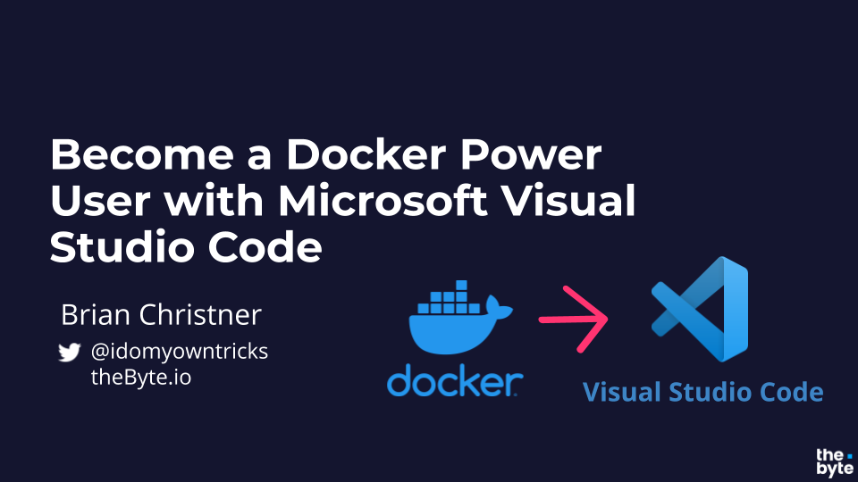
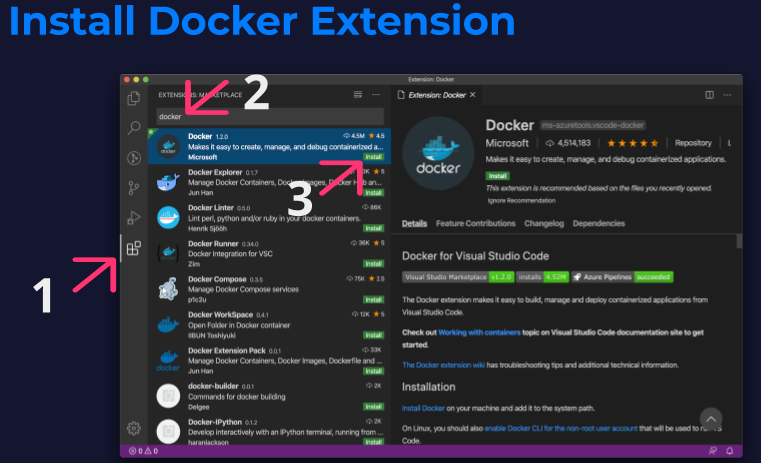

# Become a Docker Power User with Microsoft Visual Studio Code

 

# Install & Configure VS Code & Docker Extension

## 1. Prerequisites

The following prerequisites are recommended in order to complete the Labs.

1. Permission to install Docker & VS Code
2. Docker installed for your Operations System
    - [Install Docker for Linux](https://docs.docker.com/engine/install/)
    - [Install Docker Desktop for Mac](https://docs.docker.com/docker-for-mac/install/)
    - [Install Docker Desktop for Windows](https://docs.docker.com/docker-for-windows/install/)
3. [Install Git](https://git-scm.com/book/en/v2/Getting-Started-Installing-Git)

## 2. Install VS Code

1. Download VS Code for your Operating System https://code.visualstudio.com/download
2. Install VS Code
3. Open VS Code after install

## 3. Install Docker Extension
Once VS Code is installed we can install the Docker Extension using the VS Code Marketplace

1. Open the VS Code Marketplace
2. Type Docker in the Marketplace search
3. Click `install` on the Official Docker extension

 

## 4. Interact with Docker Extension UI

# Continue to the next section, Docker & VS Code Power User mode

### Click here to continue -> [04 Power User](./../04-power-user/poweruser.md)