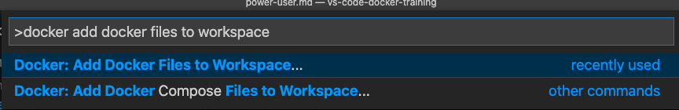

# Become a Docker Power User with Microsoft Visual Studio Code

 

Welcome to [theByte](https://www.thebyte.io) training platform. This repo contains all the labs and material for the **Become a Docker Power User with Microsoft Visual Studio Code Training** course. This repo contains [Visual Studio Code](https://code.visualstudio.com) and [VS Code Docker extension](https://marketplace.visualstudio.com/items?itemName=ms-azuretools.vscode-docker) course resources for the [Become a Docker Power User with Microsoft Visual Studio Code Course](https://www.thebyte.io/become-a-docker-power-user-with-microsoft-visual-studio-code). The goal of the course is to demonstrate new workflows, tips, tricks, and improve your Docker workflow.

The course is authored both by the respective companies or organizations, and by members of the community. We welcome contributions and want to grow the repo.

The course will refer to Microsoft Visual Studio Code as VS Code.

# Docker & VS Code Power User Mode

## 1. Bootstrap a New Project

First, we will bootstrap our Python Flask project.

1. Checkout this repo locally where you have VS Code installed `git clone https://github.com/thebyteio/vs-code-docker-training.git`
2. Open VS Code
3. Open a New Terminal by going to VS Code Menu `Terminal -> New Terminal` 
4. Navigate to the `04-power-user` folder `cd 04-power-user`
5. Open the Command Palette `Mac ⇧⌘P` `Windows CTRL + SHIFT + P`
6. Type in the Command Palette `Docker Add Docker files to workspace`
    
7. Choose **`Python Flask`** as application type
8. Application entrypoint is **`04-power-user/app.py`**
9. Port **`5000`**
10. Include optional Docker Compose files? **`YES`**

## 2. Start the new Bootsrapped Python Application
Next, we will start our newly created Docker bootstrapped application.

1. Right Click on `docker-compose.yml` and select `compose up`
2. Next, click the Docker Extension icon (The Docker whale in the right toolbar)
3. You should now see our vscode demo application as a running container
4. Right click the `vscodedockertraining` and select `Open in a Browser`
5. Test the different options available with the container
6.  Right click the `vscodedockertraining` and select `View Logs`
7.  Right click the `vscodedockertraining` and select `Inspect`
8.  Try the rest Stop, Start, Restart, attach to the shell

## 3. Build Docker Image

Now, head back to File explorer which is the file icon in the top left

1. Right click on the `Dockerfile`and select `Build Image`
2. Choose the name of the image and tag

## 4. Shutdown our Application

We finished working with our Cat GIF application so now it is time to cleanup.

1. Right click on `docker-compose.yml` and select `Compose Down`

## 5. Write a Dockerfile with Command Completion

Now, we will create a blank Dockerfile and fill in the Dockerfile using command completion and query Docker Hub

1. Create a new file in the **`04-power-user/app.py`** directory called `Dockerfile`
2. First line type: `FRO` and type `CTRL+Space` to see the command completion
3. Select, `FROM`
4. Now type the image name with just the first characters `alp` and again `CTRL + Space` to get command completion to get the image name `alpine` and click on the top image to use the official image
5. Now query the tags from Docker Hub by typing `alpine:` and again `CTRL + Space` to query the image tags
6. Type the below Dockerfile
7. Final line type `CM` and again `CTRL + Space`to get the `CMD` command completion

```docker
FROM alpine:3.12

RUN apk add --no-cache mysql-client

CMD [ "mysql" ]
```

## 8. Connect to Docker Hosts direct from VS Code

Using the `docker context` feature we can connect to remote Docker hosts. In this demo we start a container running Docker in Docker (DND). We can then connect to the DND container and launch containers inside the DND container completely separated from our original environment.

1. Start Docker in Docker `docker run --rm -d -p 2375:2375 --privileged -e "DOCKER_TLS_CERTDIR=" --name dind docker:19.03-dind`
2. Create context `docker context create dind --docker "host=tcp://127.0.0.1:2375" --default-stack-orchestrator swarm`
3. Open the Docker Extension
4. Expand the `Contexts` section
5. Right click on `DIND` and click `use`
6. Launch a test container inside the DND container: `docker container run --rm -tip 5000:5000 --name cats mikesir87/cats:1.0`
7. You should now see the Cats image and Cat container appear.

# Continue to the next section, Debug Docker with VS Code

### Click here to continue -> [05 Debug Docker with VS Code](./../05-debug-docker/debug-docker-vscode.md)