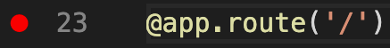
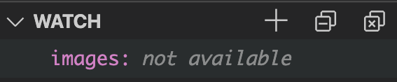

# Become a Docker Power User with Microsoft Visual Studio Code

 

# Debug using Docker & VS Code

The Debug feature is one of the most powerful features available inside VS Code. This section we will learn how to configure debug, we will launch our Python Flask demo application in Debug mode, insert breakpoints to help us troubleshoot, and finally troubleshoot and fix our application.

## 1. Break our app and Launch project in Debug mode

In the lab we will launch our Python Flask demo application in Debug mode.

1. Copy the `Dockerfile` in the root of the project to `04-power-user` directory
2. Navigate to the `04-power-user` folder
3. Click and open `app.py`
4. On line 10 we want to add an extra `s`to images so it breaks our application like:

```
imagess = [
```

4. Launch the debugger. On the left tool bar click the Triangle and Bug icon
5. At the top of the Debug screen click the Green Triangle to start debug
6. Our application will automatically launch in the browser

## 2. Insert Breakpoints and Watch Variables

Now, we will start debugging why our application is not starting by inserting break points and watch variables.

1. Navigate to the `04-power-user` folder
2. Click and open `app.py`
3. To the left of line 23 hover with your mouse and you will see a red dot appear (Breakpoint). Click the red dot to create a breakpoint.

 

4. Open the Debug screen (Triangle with the bug) and hover over the `WATCH` section and click the `+`
5. Type `images` for the Expression to watch
 

6. Start Debug Click Green Triangle at the top of Debug screen
7. Review the `Variable` and `WATCH` screen output. You should notice the `imagess` variable is captured and shows the images while the `WATCH` returns an error.

## 3. Fix Our Demo App.

Now, we have the information to repair our demo app. Let's make the fix and rerun debug.

1. Navigate to the `04-power-user` folder
2. Click and open `app.py`
3. Fix the `images` variable on line 10 as follows:

```
images = [
```

4. Open the Debug screen again
5. Start Debug
6. We should now see the variables populate in the `WATCH` window
7. Once we see the `images` variable works we can remove the `breakpoint` in the `app.py` file on line 23 by clicking the red dot.
8. Rerun Debug
9. Celebrate for fixing our application!

# Continue to the next section, Remote Development in Containers

### Click here to continue -> [06 Remote Development in Containers](./../06-remote-development/remote-dev.md)